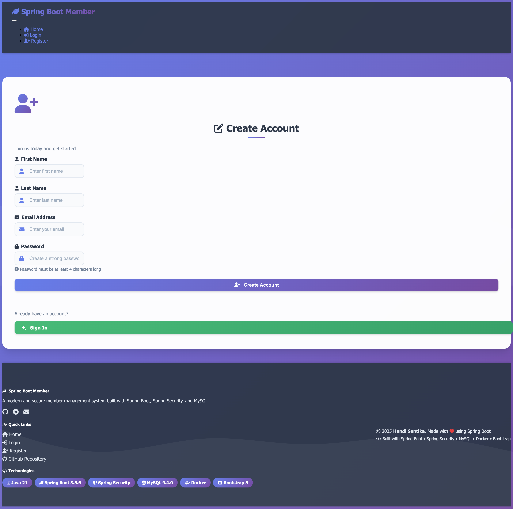
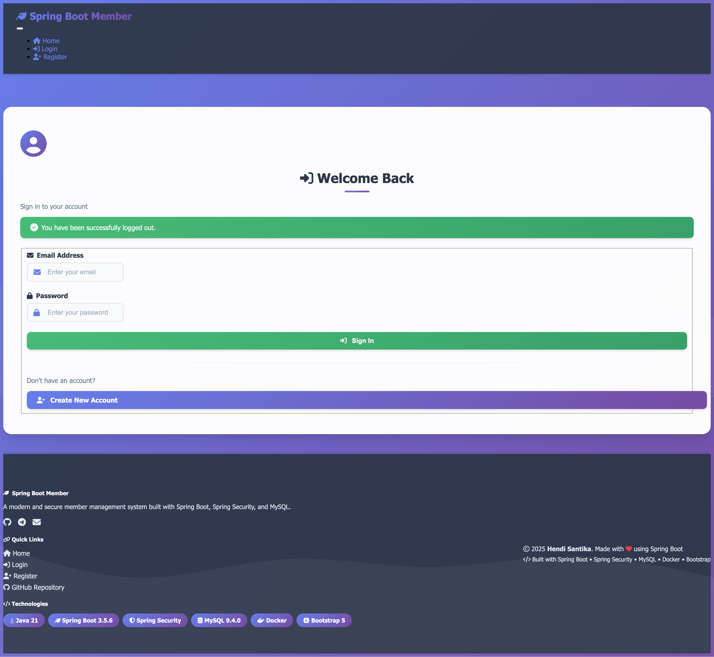
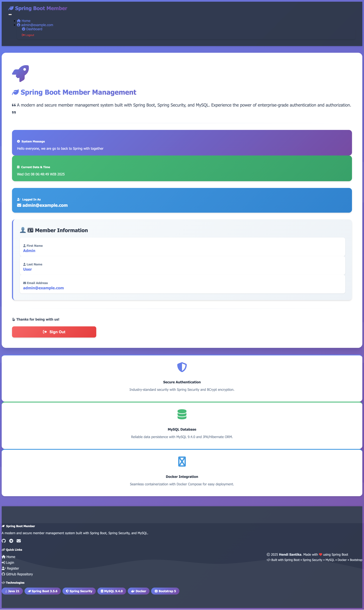

# Spring Boot Member Management System

[](https://spring.io/projects/spring-boot)
[](https://www.oracle.com/java/)
[](https://www.mysql.com/)
[](https://www.docker.com/)
[](LICENSE)

A comprehensive Spring Boot application for member management with Spring Security authentication, MySQL database
integration using Docker Compose, and modern UI components.

## Image Screenshot

Register Page



Login Page



Dashboard Page



## 📋 Table of Contents

- [Features](#features)
- [Technologies](#technologies)
- [Prerequisites](#prerequisites)
- [Quick Start](#quick-start)
- [Configuration](#configuration)
- [Database Setup](#database-setup)
- [Security](#security)
- [API Endpoints](#api-endpoints)
- [Project Structure](#project-structure)
- [Development Guide](#development-guide)
- [Testing](#testing)
- [Deployment](#deployment)
- [Troubleshooting](#troubleshooting)
- [Contributing](#contributing)
- [License](#license)

## ✨ Features

### Core Features

- 🔐 **User Authentication & Authorization** - Secure login/logout with Spring Security
- 👤 **User Registration** - Self-service user registration with email validation
- 🔑 **Role-Based Access Control (RBAC)** - Admin role management
- 🗄️ **Database Integration** - MySQL 9.4.0 with JPA/Hibernate
- 🐳 **Docker Compose Support** - Automatic database container management
- 🎨 **Modern UI** - Bootstrap 5.3.8, jQuery, and SweetAlert2
- 🔄 **Auto Database Init** - Automatic schema creation and admin user setup
- 🛡️ **Password Encryption** - BCrypt password hashing
- 📊 **Session Management** - Secure session handling
- 🌐 **Responsive Design** - Mobile-friendly interface

### Additional Features

- Hot reload with Spring DevTools
- Lombok integration for cleaner code
- Thymeleaf templates with layout dialect
- Form validation with Bean Validation
- Exception handling and error pages
- Logging configuration
- Maven build automation

## 🛠 Technologies

### Backend

- **Spring Boot 3.5.6** - Application framework
- **Spring Security 6.5.5** - Authentication & authorization
- **Spring Data JPA** - Data persistence
- **Hibernate 6.6.29** - ORM framework
- **Java 21** - Programming language
- **Maven** - Build tool
- **Lombok** - Code generation

### Database

- **MySQL 9.4.0** - Relational database
- **HikariCP** - Connection pooling
- **Flyway/Liquibase ready** - Database migration (optional)

### Frontend

- **Thymeleaf 3.1.3** - Template engine
- **Bootstrap 5.3.8** - CSS framework
- **jQuery 3.7.1** - JavaScript library
- **SweetAlert2 11.24.0** - Beautiful alerts
- **Thymeleaf Layout Dialect** - Template layouts

### DevOps & Tools

- **Docker & Docker Compose** - Containerization
- **Spring Boot Docker Compose** - Auto container management
- **Spring Boot DevTools** - Hot reload
- **Git** - Version control

## 📦 Prerequisites

Before you begin, ensure you have the following installed:

- **Java Development Kit (JDK) 21** or higher
  ```bash
  java -version
  # Should show: java version "21.x.x"
  ```

- **Apache Maven 3.6+**
  ```bash
  mvn -version
  # Should show: Apache Maven 3.x.x
  ```

- **Docker & Docker Compose**
  ```bash
  docker --version
  docker-compose --version
  ```

- **Git** (for cloning the repository)
  ```bash
  git --version
  ```

## 🚀 Quick Start

### 1. Clone the Repository

```bash
git clone https://github.com/hendisantika/spring-boot-member.git
cd spring-boot-member
```

### 2. Build the Project

```bash
mvn clean install
```

### 3. Run the Application

```bash
mvn spring-boot:run
```

The application will:

- Automatically start the MySQL Docker container
- Create the database schema
- Initialize the default admin user
- Start on `http://localhost:8080`

### 4. Access the Application

Open your browser and navigate to:

- **Application:** http://localhost:8080
- **Login Page:** http://localhost:8080/login

### 5. Login with Default Admin

```
Email: admin@example.com
Password: admin
```

## ⚙️ Configuration

### Application Properties

The main configuration file is located at `src/main/resources/application.properties`:

```properties
# Database Configuration
spring.datasource.url=jdbc:mysql://localhost:3310/memberdb?createDatabaseIfNotExist=true
spring.datasource.username=yu71
spring.datasource.password=53cret
# JPA/Hibernate Configuration
spring.jpa.hibernate.ddl-auto=update
spring.jpa.show-sql=true
spring.jpa.properties.hibernate.format_sql=true
# Server Configuration
server.port=8080
```

## 🗄️ Database Setup

### Docker Compose Configuration

The `docker-compose.yml` file:

```yaml
services:
  mysql:
    image: mysql:9.4.0
    container_name: spring-boot-member-mysql
    environment:
      MYSQL_ROOT_PASSWORD: 53cret
      MYSQL_DATABASE: memberdb
      MYSQL_USER: yu71
      MYSQL_PASSWORD: 53cret
    ports:
      - "3310:3306"
    volumes:
      - mysql_data:/var/lib/mysql

volumes:
  mysql_data:
```

### MySQL Connection Details

| Property          | Value                          |
|-------------------|--------------------------------|
| **Host**          | localhost                      |
| **Port**          | 3310 (host) → 3306 (container) |
| **Database**      | memberdb                       |
| **Username**      | yu71                           |
| **Password**      | 53cret                         |
| **Root Password** | 53cret                         |
| **Image**         | mysql:9.4.0                    |

### Manual Docker Commands

```bash
# Start MySQL container
docker-compose up -d

# Stop MySQL container
docker-compose down

# View container logs
docker-compose logs -f mysql

# Access MySQL CLI
docker exec -it spring-boot-member-mysql mysql -uyu71 -p53cret memberdb

# Check container status
docker ps
```

### Database Schema

#### `member` Table

- email (PK)
- first_name
- last_name
- password (BCrypt encrypted)

#### `role` Table

- name (PK)

#### `member_roles` Join Table

- member_email (FK)
- role_name (FK)

## 🔒 Security

### Default Admin User

```
Email: admin@example.com
Password: admin
Role: ADMIN
```

**⚠️ IMPORTANT:** Change the default password in production!

### Security Configuration

- **Authentication:** Form-based login
- **Password Encoding:** BCrypt
- **Session Management:** HttpSession
- **CSRF Protection:** Enabled

### Protected vs Public URLs

| URL Pattern   | Access                      |
|---------------|-----------------------------|
| `/`           | Public (redirects to login) |
| `/login`      | Public                      |
| `/register`   | Public                      |
| `/webjars/**` | Public                      |
| All others    | Requires authentication     |

## 🌐 API Endpoints

### Public Endpoints

| Method | Endpoint    | Description          |
|--------|-------------|----------------------|
| GET    | `/`         | Home page            |
| GET    | `/login`    | Login form           |
| POST   | `/login`    | Process login        |
| GET    | `/register` | Registration form    |
| POST   | `/register` | Process registration |
| POST   | `/logout`   | Logout user          |

## 📁 Project Structure

```
spring-boot-member/
├── src/main/java/com/hendisantika/
│   ├── config/
│   │   ├── DataInitializer.java          # Auto-create admin user
│   │   └── SecurityConfig.java            # Spring Security config
│   ├── controller/
│   │   ├── IndexController.java           # Home page controller
│   │   └── MemberController.java          # Member CRUD controller
│   ├── entity/
│   │   ├── Member.java                    # Member entity
│   │   └── Role.java                      # Role entity
│   ├── repository/
│   │   ├── MemberRepository.java          # Member data access
│   │   └── RoleRepository.java            # Role data access
│   ├── service/
│   │   ├── CustomUserDetailsService.java  # Authentication service
│   │   └── MemberService.java             # Member business logic
│   └── SpringBootMemberApplication.java   # Main class
├── src/main/resources/
│   ├── templates/                          # Thymeleaf templates
│   └── application.properties              # Configuration
├── docker-compose.yml                      # Docker Compose config
└── pom.xml                                 # Maven configuration
```

## 👨‍💻 Development Guide

### Running in Development Mode

```bash
mvn spring-boot:run
```

### Building for Production

```bash
mvn clean package
java -jar target/spring-boot-member-0.0.1-SNAPSHOT.jar
```

### Code Style Best Practices

1. Use Lombok to reduce boilerplate
2. Use Constructor Injection instead of @Autowired
3. Use @Transactional for database operations
4. Validate inputs with Bean Validation

## 🧪 Testing

```bash
# Run all tests
mvn test

# Run with coverage
mvn clean test jacoco:report
```

## 🚢 Deployment

### Deploy with Docker

```bash
# Build image
docker build -t spring-boot-member:latest .

# Run with Docker Compose
docker-compose up -d
```

## 🔧 Troubleshooting

### Port Already in Use

Modify `docker-compose.yml`:

```yaml
ports:
  - "3311:3306"  # Change host port
```

Update `application.properties`:

```properties
spring.datasource.url=jdbc:mysql://localhost:3311/memberdb...
```

### MySQL Connection Issues

```bash
# Check Docker status
docker ps

# View logs
docker-compose logs mysql

# Restart containers
docker-compose restart
```

### LazyInitializationException

Add `@Transactional` to your service method:

```java

@Transactional(readOnly = true)
public Member findMember(String email) {
    return memberRepository.findByEmail(email);
}
```

## 🤝 Contributing

1. Fork the repository
2. Create a feature branch
3. Commit your changes
4. Push to the branch
5. Open a Pull Request

## 📝 License

This project is licensed under the MIT License.

## 👤 Author

**Hendi Santika**

- Email: hendisantika@gmail.com
- Telegram: [@hendisantika34](https://t.me/hendisantika34)
- GitHub: [@hendisantika](https://github.com/hendisantika)

## 🙏 Acknowledgments

- [Spring Boot](https://spring.io/projects/spring-boot) - Application framework
- [Spring Security](https://spring.io/projects/spring-security) - Security framework
- [Thymeleaf](https://www.thymeleaf.org/) - Template engine
- [MySQL](https://www.mysql.com/) - Database system
- [Bootstrap](https://getbootstrap.com/) - CSS framework
- [SweetAlert2](https://sweetalert2.github.io/) - Alert library

## 📚 Additional Resources

- [Spring Boot Documentation](https://docs.spring.io/spring-boot/docs/current/reference/html/)
- [Spring Security Reference](https://docs.spring.io/spring-security/reference/)
- [Thymeleaf Tutorial](https://www.thymeleaf.org/doc/tutorials/3.1/usingthymeleaf.html)
- [Docker Documentation](https://docs.docker.com/)
- [MySQL Documentation](https://dev.mysql.com/doc/)

---

**⭐ If you find this project helpful, please give it a star!**

*Last Updated: October 8, 2025*
